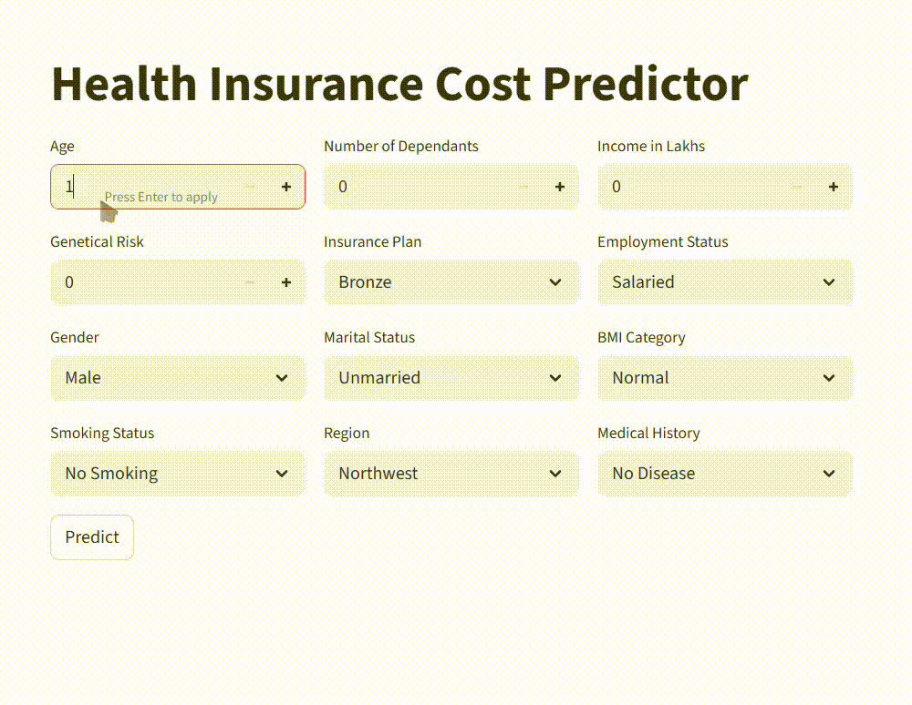

# ML Project – Health Insurance Premium Prediction

[](LICENSE)

## Demo / Preview



## Table of Contents

- [About](#about)  
- [Features](#features)  
- [Data](#data)  
- [Tech Stack](#tech-stack)  
- [Installation](#installation)  
- [Usage](#usage)  
- [Project Structure](#project-structure)  
- [Evaluation & Results](#evaluation--results)  
- [Contributing](#contributing)  
- [License](#license)  
- [Contact](#contact)

---

## About

This repository implements a machine learning model to **predict health insurance premiums** based on various user attributes. The goal is to help users/insurers estimate premium costs based on features like age, BMI, smoking status, etc.

---

## Features

- Preprocessing of data for clean, usable input  
- Model training pipeline  
- Prediction helper utilities for inference  
- Capability to evaluate model performance  

---

## Data

*(If you have a dataset, mention source, columns/features, size, etc.)*

- Features likely include: age, sex, BMI, number of children, smoking status, region, etc.  
- Target: insurance charges/premium  

---

## Tech Stack

- **Language:** Python  
- **Libraries:** pandas, numpy, scikit-learn (or whatever you used)  
- Possibly others: matplotlib / seaborn (if plotting), joblib / pickle (if saving model)  

---

## Installation

1. Clone the repo:  
   ```bash
   git clone https://github.com/ShaileshLambode/ml-project-premium-prediction.git
   cd ml-project-premium-prediction
   ```

2. Set up a Python environment (venv / conda):  
   ```bash
   python3 -m venv venv
   source venv/bin/activate    # on Linux/macOS
   venv\Scripts\activate       # on Windows
   ```

3. Install dependencies:  
   ```bash
   pip install -r requirements.txt
   ```

---

## Usage

After installing:

- To train the model (if there is a training script):  
  ```bash
  python main.py
  ```

- To make a prediction:  
  Use functions in `prediction_helper.py` (for example):  
  ```python
  from prediction_helper import predict_premium
  result = predict_premium(age=30, sex='male', bmi=25.0, ...
  print("Estimated premium:", result)
  ```

- (Optional) To evaluate metrics such as RMSE, MAE, R², etc.

---

## Project Structure

```
ml-project-premium-prediction/
├── .devcontainer/                # dev container config (IDE environment)
├── artifacts/                    # saved models, generated outputs (if any)
├── main.py                       # primary script: training / application logic
├── prediction_helper.py          # helper functions for inference
├── requirements.txt              # Python package dependencies
├── LICENSE                       # Project licensing
└── README.md
```

---

## Evaluation & Results

*(Fill in with your model’s performance metrics, plots, and observations.)*

- Example metrics: RMSE = ___, R² = ___  
- Insights: which features most influenced premium, any unexpected behavior, etc.

---

## Contributing

Contributions are welcome! If you want to add features, improve documentation, or optimize model performance:

1. Fork the repository  
2. Create a new branch (`git checkout -b feature-name`)  
3. Make your changes & commit (`git commit -m "Add <feature>"`)  
4. Push to your branch (`git push origin feature-name`)  
5. Open a pull request and describe what you changed  

---

## License

This project is licensed under the **Apache License 2.0**. See the [LICENSE](LICENSE) file for details.

---

## Contact

- **Author:** Shailesh Lambode  
- **GitHub:** [ShaileshLambode](https://github.com/ShaileshLambode)  
- **Email:** shaileshlambode2908@gmail.com
